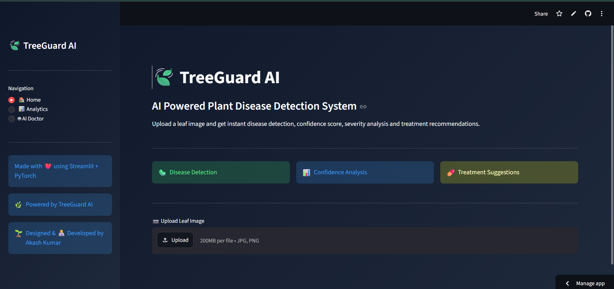
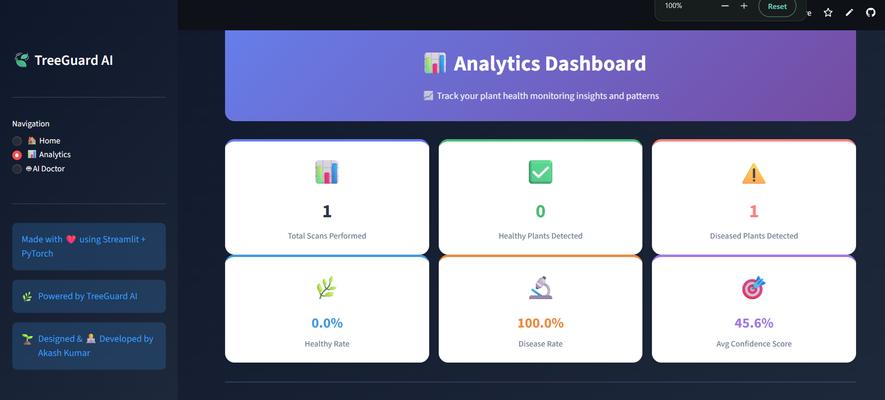

<div align="center">

</div>

####  **🔗 Try TreeGuard AI Here:**

[TreeGuard AI Live Demo](https://treeguard-ai.streamlit.app/)

# 🍃 TreeGuard AI
### AI-Powered Plant Disease Detection & Health Advisory System

[](https://python.org)
[](https://pytorch.org)
[](https://streamlit.io)
[](https://groq.com)
[](LICENSE)

> Upload a leaf photo → Get instant disease detection, treatment advice, PDF report & AI Doctor chat

</div>

---

## 📋 Table of Contents

| # | Section |
|---|---------|
| 1 | [🚨 Problem Statement](#-problem-statement) |
| 2 | [💡 Proposed Solution](#-proposed-solution) |
| 3 | [🌟 Key Features](#-key-features) |
| 4 | [🏗️ System Architecture](#%EF%B8%8F-system-architecture) |
| 5 | [⚙️ Technologies Used](#%EF%B8%8F-technologies-used) |
| 6 | [🧠 Model Development](#-model-development) |
| 7 | [📂 Dataset](#-dataset) |
| 8 | [🔬 Training Pipeline](#-training-pipeline) |
| 9 | [🎛️ Fine-Tuning](#%EF%B8%8F-fine-tuning) |
| 10 | [📈 Model Performance](#-model-performance) |
| 11 | [📸 Screenshots](#-screenshots) |
| 12 | [🚀 Installation](#-installation) |
| 13 | [📖 How to Use](#-how-to-use) |
| 14 | [🔮 Future Plans](#-future-plans) |
| 15 | [👨‍💻 Developer](#-developer) |

---

## 🚨 Problem Statement

> **Plant diseases cause 20–40% loss in global crop production every year.**

Farmers and plant owners face serious challenges every day:

| Problem | Impact |
|---------|--------|
| ❌ Hard to identify diseases in early stage | Disease spreads uncontrolled |
| ❌ No access to agricultural experts nearby | Wrong or no treatment applied |
| ❌ Incorrect treatment methods used | Wastes money and chemicals |
| ❌ Delayed diagnosis | Massive crop yield loss |
| ❌ Expensive laboratory testing required | Not affordable for small farmers |
| ❌ No 24/7 advisory service available | Farmers left without guidance |

Traditional disease diagnosis **requires expert knowledge, manual inspection, and is expensive and slow** — not suitable for millions of small-scale farmers.

---

## 💡 Proposed Solution

**TreeGuard AI** is an intelligent web application that uses **Deep Learning + AI** to solve this problem automatically.

The user simply uploads a leaf photo and the system does everything:

```
📷 Upload Leaf Photo
        ↓
🧠 AI Detects Disease (CNN Model)
        ↓
🎯 Confidence Score Calculated
        ↓
⚠️  Severity Level Assessed
        ↓
💊 Treatment & Prevention Provided
        ↓
🤖 AI Doctor Answers Follow-up Questions
        ↓
🔊 Voice Output + 📄 PDF Report Generated
```

**Result:** Any farmer anywhere can diagnose plant diseases in under 5 seconds — for free — without needing an expert.

---

## 🌟 Key Features

<table>
<tr>
<td width="50%">

### 🦠 Disease Detection
Detects multiple plant diseases from a single leaf image using a trained CNN model in under 5 seconds.

### 🎯 Confidence Score
Shows a percentage confidence level for every prediction so you know how reliable the result is.

### ⚠️ Severity Assessment
Automatically categorises disease severity as **Low / Medium / High Risk** based on confidence level.

### 💊 Treatment Suggestions
Provides actionable, disease-specific treatment plans including chemical and organic options.

### 🛡️ Prevention Tips
Suggests preventive measures to stop the disease from spreading or recurring in future.

</td>
<td width="50%">

### 🤖 AI Plant Doctor
Interactive chatbot powered by **Llama 3.3 70B** (via Groq API) for personalised plant-health Q&A.

### 🔊 Voice Assistant
Converts AI responses to speech using **Edge-TTS** — great for farmers who prefer listening.

### 📄 PDF Report
Generates a professional downloadable PDF with all results, treatments, and prevention info.

### 📊 Analytics Dashboard
Visual charts and statistics showing total scans, healthy rate, disease rate, and scan history.

### 🕒 Scan History
Saves all previous scans locally so you can track plant health over time.

</td>
</tr>
</table>

---

## 🏗️ System Architecture

```
┌─────────────────────────────────────────────────────────────┐
│                        USER INTERFACE                        │
│              Streamlit Web App (HTML + CSS)                  │
└──────────────────────────┬──────────────────────────────────┘
                           │
          ┌────────────────┼────────────────┐
          ▼                ▼                ▼
   ┌─────────────┐  ┌─────────────┐  ┌─────────────┐
   │  🧠 CNN     │  │ 🤖 Groq LLM │  │ 📊 Analytics│
   │  PyTorch    │  │ Llama 3.3   │  │  Plotly     │
   │  Model      │  │ AI Doctor   │  │  Dashboard  │
   └──────┬──────┘  └──────┬──────┘  └─────────────┘
          │                │
          ▼                ▼
   ┌─────────────┐  ┌─────────────┐
   │ ⚠️ Severity  │  │ 🔊 Edge-TTS │
   │  Analyser   │  │  Voice Out  │
   └──────┬──────┘  └─────────────┘
          │
          ▼
   ┌─────────────┐
   │ 📄 ReportLab│
   │  PDF Report │
   └─────────────┘
```

### Component Breakdown

| Layer | Tool | Purpose |
|-------|------|---------|
| 🖥️ Frontend | Streamlit + HTML/CSS | User interface, pages, chat, charts |
| 🧠 AI Model | CNN (PyTorch) | Classifies leaf image into disease categories |
| 💬 LLM | Llama 3.3 via Groq | AI Plant Doctor chatbot |
| 🔊 Voice | Edge-TTS | Converts text responses to MP3 audio |
| 📊 Charts | Plotly | Interactive visualisations |
| 📄 Report | ReportLab | Generates PDF documents |
| 💾 Storage | Local JSON | Saves past scan history |

---

## ⚙️ Technologies Used

### 🖥️ Frontend / UI


### 🐍 Backend


### 🧠 AI & Deep Learning


### 🖼️ Computer Vision


### 📊 Data & Visualisation


### 📄 Reports & Voice


---

## 🧠 Model Development

TreeGuard AI uses a **Convolutional Neural Network (CNN)** — a type of Deep Learning model specially designed to understand images.

### 🔍 What is a CNN? (Simple Explanation)

Think of a CNN like teaching a human eye to spot disease patterns, but at machine speed:

```
Raw Leaf Image
      ↓
Conv Layer 1 → Detects edges and colours
      ↓
Conv Layer 2 → Detects textures and patterns
      ↓
Conv Layer 3 → Detects disease-specific shapes
      ↓
Fully Connected → Classifies disease type
      ↓
Softmax Output → "Tomato Late Blight — 94.3%"
```

**Example thought process:**
> Detects "yellow spots" → recognises "pattern of spots on leaf edges" → concludes **"Bacterial Spot disease — 91% confidence"**

---

## 📂 Dataset

The model was trained on a plant disease image dataset containing **thousands of labelled leaf images** across multiple species and disease types.

### Disease Classes

| Icon | Disease                   | Description                                                      |
| ---- | ------------------------- | ---------------------------------------------------------------- |
| 🦠   | Tomato Bacterial Spot     | Small dark spots surrounded by yellow halos on leaves and fruits |
| 🍂   | Tomato Late Blight        | Rapidly spreading brown or black lesions causing leaf decay      |
| 🍃   | Tomato Leaf Mold          | Yellow spots on upper leaf surface with mold growth underneath   |
| 🌿   | Tomato Septoria Leaf Spot | Small circular gray spots with dark borders on leaves            |
| ✅    | Tomato Healthy            | Healthy tomato leaf with no visible disease symptoms             |

## Dataset Distribution

| Disease Class             | Images |
| ------------------------- | -----: |
| Tomato Bacterial Spot     |  2,127 |
| Tomato Late Blight        |  1,909 |
| Tomato Septoria Leaf Spot |  1,771 |
| Tomato Healthy            |  1,591 |
| Tomato Leaf Mold          |    952 |

**Total Images:** 8,350
### Data Split Strategy

The dataset was divided into three parts to ensure proper model training and evaluation.

```text
Total Dataset (8,350 Images)
├── 80% → Training Set (~6,680 Images)
├── 10% → Validation Set (~835 Images)
└── 10% → Test Set (~835 Images)
```

* **Training Set:** Used to train the Deep Learning model.
* **Validation Set:** Used to monitor model performance and prevent overfitting during training.
* **Test Set:** Used for final evaluation on unseen data to measure real-world performance.

This split helps ensure that the model generalizes well and provides reliable predictions on new leaf images.


> **Why split?** Splitting ensures the model is tested on images it has **never seen before**, giving a fair and honest performance score.

---

## 🔬 Training Pipeline

The Deep Learning model was trained using a structured pipeline to ensure accurate and reliable plant disease classification.

### Step 1 — Dataset Preparation

The dataset was organized into disease-specific categories and loaded using PyTorch's data handling utilities. Each image was assigned a corresponding class label for supervised learning.

### Step 2 — Image Preprocessing

Before training, all images were standardized through:

* Image resizing to a fixed resolution (224 × 224 pixels)
* Tensor conversion for model compatibility
* Pixel value normalization to improve training stability

These preprocessing steps ensure that all images follow a consistent format.

### Step 3 — Data Augmentation

To improve model generalization and reduce overfitting, several augmentation techniques were applied:

* Horizontal flipping
* Random rotation
* Brightness and contrast adjustments

This helps the model recognize plant diseases under different lighting conditions, viewing angles, and real-world environments.

### Step 4 — Model Training

The model was trained using supervised learning on labeled leaf images.

During training:

* Images were passed through the neural network
* Prediction errors were calculated using a loss function
* Backpropagation was applied to update model weights
* Validation accuracy was monitored after each epoch
* The best-performing model was automatically saved

### Step 5 — Model Evaluation

The trained model was evaluated on unseen validation images to measure its classification performance and ensure reliable disease detection.

### Step 6 — Deployment

After training, the best model was integrated into the TreeGuard AI application. Users can upload a leaf image, and the system performs:

* Disease Classification
* Confidence Analysis
* Severity Assessment
* Treatment Recommendation
* AI-Based Plant Health Guidance

This end-to-end pipeline enables real-time plant disease detection through a simple and user-friendly web interface.


## 🎛️ Fine-Tuning

Fine-tuning means taking the trained model and making it **smarter and more accurate** through careful adjustments.

> **Simple Analogy:** Like taking a student who already knows biology and giving them extra focused lessons specifically about plant diseases.

### Techniques Used

#### 1️⃣ Learning Rate Optimisation
```python
# Start with a base learning rate
optimizer = torch.optim.Adam(model.parameters(), lr=0.001)

# Reduce learning rate when improvement plateaus
scheduler = torch.optim.lr_scheduler.ReduceLROnPlateau(
    optimizer, mode='max', factor=0.5, patience=3
)
```
> Too large LR → model overshoots optimal weights  
> Too small LR → training is very slow  
> Scheduler → adjusts it automatically 🎯

## 🎛️ Model Optimization & Fine-Tuning

Several optimization techniques were considered to improve model performance and training efficiency.

### Early Stopping

Validation performance was continuously monitored during training to identify the best-performing model and avoid unnecessary training once the model converged.

### Transfer Learning

Pre-trained deep learning architectures can be used to leverage previously learned image features such as edges, textures, and patterns. This approach reduces training time and improves performance when working with limited datasets.

### Optimizer Selection

The model was trained using modern optimization techniques to efficiently update network weights and minimize classification error. Proper learning rate selection and weight optimization contributed to stable convergence and improved accuracy.

### Overfitting Prevention

To improve generalization and robustness, the training process incorporated:

* Data augmentation
* Validation monitoring
* Image normalization
* Regularized training strategies

These techniques helped the model achieve strong classification performance while maintaining reliable predictions on unseen plant leaf images.


## 📈 Model Performance

The model was evaluated on unseen plant leaf images to measure its ability to correctly identify diseases in real-world scenarios

### Current Status

Performance evaluation is being continuously improved with additional testing and validation datasets. The model has demonstrated reliable disease classification across all supported tomato leaf disease categories.


> Future versions will include detailed confusion matrices, class-wise accuracy, and additional evaluation metrics.

Performance is measured on the **test set** — images the model has **never seen** during training.
## 📈 Model Performance

The model was trained for 15 epochs using PyTorch and achieved strong classification performance on the validation dataset.

| Metric | Score |
|---------|--------|
| ✅ Training Accuracy | 93.80% |
| 🎯 Best Validation Accuracy | 95.45% |
| 📉 Final Training Loss | 0.2677 |
| 📉 Final Validation Loss | 0.2269 |
| 🔄 Epochs | 15 |

### Performance Summary

- Achieved a best validation accuracy of **95.45%**
- Demonstrated strong generalization across unseen validation images
- Low validation loss indicates effective learning and reduced overfitting
- Reliable performance across all supported tomato leaf disease classes

### Supported Classes

- Tomato Bacterial Spot
- Tomato Late Blight
- Tomato Leaf Mold
- Tomato Septoria Leaf Spot
- Tomato Healthy


## 📸 Screenshots

### 🏠 Home Page



---

### 🤖 AI Plant Doctor


---

### 💬 AI Chat Interface


---

### 💬 Conversation Example


---

### 📊 Analytics Dashboard



## 🚀 Installation

### Prerequisites
- Python `3.10` or higher
- `pip` package manager
- Groq API Key (free at [groq.com](https://groq.com))

### Step 1 — Clone the Repository
```bash
git clone https://github.com/akashkumar223570/TreeGuard-AI.git
cd TreeGuard-AI
```

### Step 2 — Install Dependencies
```bash
pip install -r requirements.txt
```

### Step 3 — Add Your API Key
Create `.streamlit/secrets.toml` and add:
```toml
GROQ_API_KEY = "your_groq_api_key_here"
```

### Step 4 — Run the App
```bash
streamlit run app.py
```

Open your browser at **`http://localhost:8501`** 🎉

---

## 📖 How to Use

| Step | Action | Description |
|------|--------|-------------|
| 1️⃣ | **Upload Image** | Go to Home page → click "Upload Leaf Image" → select JPG/PNG photo |
| 2️⃣ | **Analyse** | Click **"Analyze Leaf"** button and wait 2–5 seconds |
| 3️⃣ | **Read Results** | View disease name, confidence %, risk level, treatment & prevention |
| 4️⃣ | **Download Report** | Click **"Download PDF"** to save a full report |
| 5️⃣ | **Ask AI Doctor** | Go to AI Doctor page → ask follow-up questions in natural language |
| 6️⃣ | **Track History** | Visit Analytics page to see all past scans and visual statistics |

### 💬 AI Doctor Tips
- Use quick-action buttons: `💊 Treatment` · `🛡 Prevention` · `⏳ Recovery` · `🌱 Organic`
- For general questions (not about the scanned plant) start your message with `/`
- Click **"🔊 Hear AI Doctor"** to listen to the response as audio

---

## 🔮 Future Plans

- [ ] 📱 **Mobile Application** — Native Android & iOS app with camera integration
- [ ] 🌿 **More Plant Species** — Expand to 50+ plants including wheat, rice, corn, grapes
- [ ] 📷 **Real-Time Camera Detection** — Live detection without uploading a file
- [ ] 🌍 **Multi-Language Support** — Hindi, Tamil, Punjabi and other regional languages
- [ ] 📅 **Disease Progression Prediction** — Predict how fast a disease will spread
- [ ] ☁️ **Cloud Database** — Store scan history across devices and locations
- [ ] 🗺️ **Disease Heatmap** — Regional map showing disease outbreaks by location
- [ ] 🔔 **Alert System** — Notify farmers when high-risk diseases are detected in their area

---
## 👨‍💻 Developer

<div align="center">

# Akash Kumar

### AI • Data Science • Machine Learning Enthusiast

Passionate about building real-world AI solutions using Deep Learning, Computer Vision, Generative AI, and Data Analytics.

🌳 Creator of **TreeGuard AI** — An AI-Powered Plant Disease Detection & Health Advisory System.

[](https://github.com/akashkumar223570)

</div>

---

## 📜 License

This project is released for **educational, research, and demonstration purposes**.

Users are free to explore, learn from, and extend the project while providing appropriate attribution to the original author.

---

<div align="center">

# 🍃 TreeGuard AI

### Detect • Analyze • Protect

Built with ❤️ using **Python, PyTorch, Streamlit, Groq, and Edge-TTS**

⭐ If you found this project useful, consider giving it a star on GitHub.

© 2026 Akash Kumar. All Rights Reserved.

</div>
